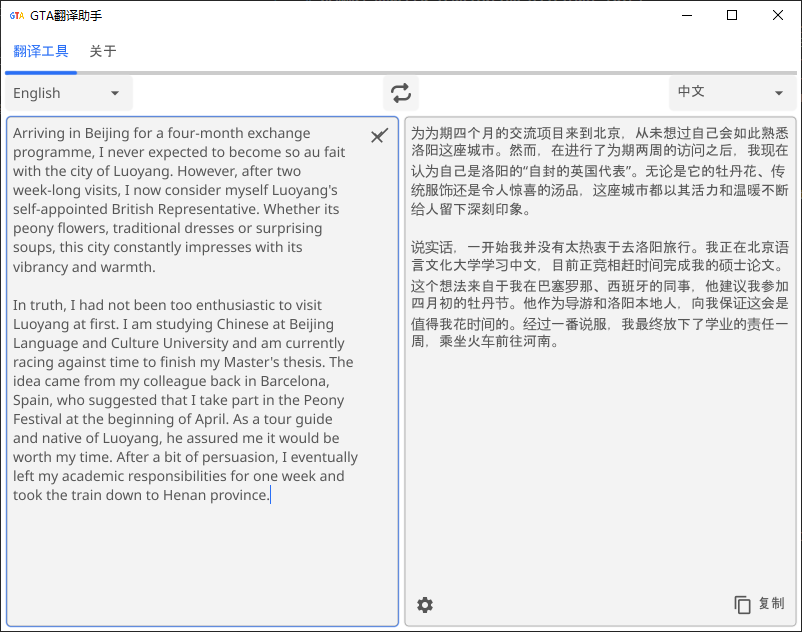

# Gemma4-powered Translation Assistant (WIP)

[简体中文](README_zh-CN.md)

GTA is a free, open-source desktop translation assistant tool. It loads and runs the Gemma 4 model server via [Kronk](https://github.com/ardanlabs/kronk), operates in a server-client mode, and supports access and use by users on a local area network. The tool is written in Go, and its user interface utilizes the [Fyne framework](https://github.com/fyne-io/fyne). It supports cross-platform use and offers full hardware acceleration (implemented via Kronk). It runs entirely on your local device (no internet connection is required once the LLM model has been downloaded).

## Why?

1) Professionalism. A long time ago, Google Translate was the most commonly used translation tool. After Gemma 4 was released, I tested its translation capabilities right away, and sure enough, it remained as professional as ever! Unlike in the past, you can now even see the translation’s thought process.
2) Flexible local deployment. Gemma 4 has certain hardware requirements. For SOHO users, you can use a high-spec computer to host a more powerful model—such as the 26B (MoE, with 4B activated) or 31B (dense) version—as a server, while other devices access it via client mode.
Of course, you can also deploy it on your own computer for personal use.
3) Privacy-focused. By deploying large models locally without using Ollama or a browser, you eliminate intermediaries, improve processing efficiency, and protect privacy and data security.
4) Scalability. Future implementations can support other Gemma 4 features such as image text extraction, article writing, or summarization.

## Getting Started

### System Requirements:

For reference: [Gemma 4 Hardware requirements on unsloth](https://unsloth.ai/docs/models/gemma-4#hardware-requirements)

Table: Gemma 4 Inference GGUF recommended hardware requirements (units = total memory: RAM + VRAM, or unified memory). You can use Gemma 4 on MacOS, NVIDIA RTX GPUs etc.

| Gemma 4 variant  |        4-bit       |         8-bit      |      BF16 / FP16   |            
|------------------|--------------------|--------------------|--------------------|
| E2B              |               4 GB |             5–8 GB |             10 GB  |
| E4B              |           5.5–6 GB |            9–12 GB |             16 GB  |
| 26B A4B          |           16–18 GB |           28–30 GB |             52 GB  |
| 31B              |           17–20 GB |           34–38 GB |             62 GB  |

- default config model is gemma-4-E2B-it-Q4_K_M.gguf. 
- 8GB of RAM (GPU) or 16GB of RAM (CPU)


## Building from source

### Prerequisites

Using the Fyne toolkit to build cross platform applications.

#### Windows
Please follow the Getting Started guide from the Fyne documentation [here](https://docs.fyne.io/started/) to setup MSYS2 and compile from within the MingW-w64 window.

#### MacOS
Set up the Xcode command line tools by opening a Terminal window and typing the following:

`xcode-select --install`

#### Linux
Find the list of dependencies for your distro in the Fyne documentation [here](https://docs.fyne.io/started/)

### Build

To build the project run the following command:
```bash
git clone https://github.com/vulcangz/gta.git
cd gta
go build
```

## Usage

Using Windows as an example.

When the client and server are running on the same computer:

1. Run the GTA service in a terminal window: gta or gta serve 
2. Run the desktop client in another terminal window: gta gui
3. You can then perform translation tasks in the open window

When the client and server are not running on the same computer:

1. Run the GTA service in a terminal window on the server: `gta` or `gta serve`
2. On the client computer, first set the environment variables related to the gRPC service, then run the desktop client in a terminal window: `gta gui`

```bash
set GTA_GRPC_HOST=your server ip
set GTA_GRPC_PORT=your server port
gta gui
```
3. You can then perform the translation in the window that opens.

The complete list of command-line options and environment variables is as follows:

```bash
gta -h
Usage: gta [options...] [arguments...]

OPTIONS
      --app-name                 <string>              (default: GTA)
      --grpc-host                <string>              (default: 0.0.0.0)
      --grpc-port                <int>                 (default: 9000)
  -h, --help                                                                                                                                              display this help message
      --log-level                <string>
      --model-max-tokens         <int>                 (default: 2048)
      --model-temperature        <float>               (default: 0.7)
      --model-top-k              <int>                 (default: 40)
      --model-top-p              <float>               (default: 0.9)
      --model-url                <string>              (default: https://huggingface.co/unsloth/gemma-4-E2B-it-GGUF/blob/main/gemma-4-E2B-it-Q4_K_M.gguf)
      --translation-input-delay  <string>              (default: 300)
      --translation-languages    <string>,[string...]  (default: English;中文;Français;Italiano;日本語;한국어;Deutsch;繁體中文)
      --translation-source       <string>              (default: English)
      --translation-target       <string>              (default: 中文)
  -v, --version                                                                                                                                           display version

ENVIRONMENT
  GTA_APP_NAME                 <string>              (default: GTA)
  GTA_GRPC_HOST                <string>              (default: 0.0.0.0)
  GTA_GRPC_PORT                <int>                 (default: 9000)
  GTA_LOG_LEVEL                <string>
  GTA_MODEL_MAX_TOKENS         <int>                 (default: 2048)
  GTA_MODEL_TEMPERATURE        <float>               (default: 0.7)
  GTA_MODEL_TOP_K              <int>                 (default: 40)
  GTA_MODEL_TOP_P              <float>               (default: 0.9)
  GTA_MODEL_URL                <string>              (default: https://huggingface.co/unsloth/gemma-4-E2B-it-GGUF/blob/main/gemma-4-E2B-it-Q4_K_M.gguf)
  GTA_TRANSLATION_INPUT_DELAY  <string>              (default: 300)
  GTA_TRANSLATION_LANGUAGES    <string>,[string...]  (default: English;中文;Français;Italiano;日本語;한국어;Deutsch;繁體中文)
  GTA_TRANSLATION_SOURCE       <string>              (default: English)
  GTA_TRANSLATION_TARGET       <string>              (default: 中文)
```


> [!NOTE]
> The first time you run this project, the system will download the required models; this process may take anywhere from a few minutes to several tens of minutes, depending on your internet connection.


## Screenshot



## Contributing
Contributions are welcome and will be fully credited.

## Acknowledgements
- [Kronk](https://github.com/ardanlabs/kronk)
- [Fyne](https://github.com/fyne-io/fyne)
- [Ctrl+Revise](https://github.com/bahelit/ctrl_plus_revise)
- [franslate](https://github.com/sercanarga/franslate)

## License
This project is licensed under the GPL-3.0 License - see the [LICENSE](LICENSE) file for details.
